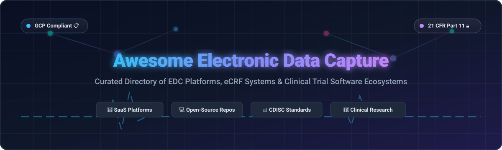

  

# 🏥 Awesome Electronic Data Capture (EDC) Ecosystem

  
  
  
  
  

---

## 📌 Introduction & Overview

**Awesome Electronic Data Capture (EDC)** is a comprehensive, SEO-optimized, community-curated directory of **commercial SaaS platforms** and **open-source software repositories** powering modern clinical trials, medical research, electronic Case Report Forms (eCRF), Good Clinical Practice (GCP) compliance, 21 CFR Part 11 validation, and CDISC data standards (SDTM, ODM-XML, ADaM).

Whether you are a **Clinical Research Coordinator (CRC)**, **Data Manager**, **Biostatistician**, **CRO Technology Lead**, or **Academic Investigator**, this repository serves as your authoritative reference for evaluating and selecting clinical trial data capture software.

---

## 💡 Table of Contents

- [📊 SaaS / Hosted Platforms](#-saas--hosted-platforms)
- [💻 Open-Source Repositories](#-open-source-repositories)
- [🤝 How to Contribute](#-how-to-contribute)
- [⚠️ Disclaimer](#%EF%B8%8F-disclaimer)
- [💖 Support & Sponsorship](#-support--sponsorship)
- [📈 Star History](#-star-history)

---

## 📊 SaaS / Hosted Platforms

> 📈 **Market Dynamics & Market Size**: The global Electronic Data Capture (EDC) market is estimated at **$2.5 Billion – $3.0 Billion in 2026** and is projected to expand to **$6.5 Billion+ by 2033** (growing at a ~13.5% CAGR). The market is **moderately fragmented**—dominated by top-tier enterprise giants (Oracle, Veeva, Medidata) for complex Phase II–IV registrational trials, while mid-market SaaS providers (Castor, Viedoc) and open-source models (REDCap, LibreClinica) capture substantial market share across investigator-initiated studies, academic trials, and decentralized clinical research.

The table below presents commercial SaaS EDC software ordered by **Company Size (Annual Revenue / Market Valuation)** in descending order.

| Name | Description | Company Size (Revenue / Valuation) | Pricing (Starting Tier) | Free Tier / Trial Limits |
| :--- | :--- | :--- | :--- | :--- |
| **[Oracle Clinical One](https://www.oracle.com/)** | Enterprise cloud platform uniting EDC, clinical data management, and trial supply logistics. | **~$53 Billion** (Oracle Annual Revenue) | ~$10,000/month per active trial | No permanent free tier; 30-day Oracle Cloud Free Tier ($300 credits) for infrastructure test environments |
| **[Veeva Vault EDC](https://www.veeva.com/)** | Cloud-native EDC platform within Veeva Development Cloud, seamlessly linking eTMF, CTMS, and CDMS. | **~$2.7 Billion** Revenue (~$35B Market Cap) | ~$12,000/month per study ($100k annual contract minimum) | No free plan; custom sandbox tenant provided for contracted customers only |
| **[MACRO EDC](https://www.elsevier.com/)** | Elsevier's enterprise EDC platform for protocol management, double data entry, and CDISC export. | **~$10 Billion** (RELX Group Revenue) | ~$5,000/month per study | No free tier; demo environment available for verified healthcare institutions |
| **[Medidata Rave](https://www.medidata.com/)** | Industry-standard EDC solution for global registrational pharmaceutical trials with deep CDISC ODM integration. | **~$6.2 Billion** (Dassault Systèmes Revenue; ~$1.0B EDC segment) | ~$15,000/month per study (enterprise contracts start at ~$150k/year) | No free tier; guided enterprise demo available upon request |
| **[IBM Clinical Development](https://www.ibm.com/)** | Unified clinical data capture system featuring eCRF, ePRO, randomization, and medical coding modules. | **~$800 Million** (Merative Revenue) | ~$8,000/month per trial module | No free tier; guided interactive sales demo available |
| **[Anju EDC](https://www.anjusoftware.com/)** | Flexible clinical data management system tailored for oncology and rare disease clinical trials. | **~$50 Million** Annual Revenue | ~$3,000/month per trial | No free tier; custom demonstration sandbox available upon request |
| **[Ennov Clinical](https://www.ennov.com/)** | Integrated EDC and document management suite for Phase I–IV clinical studies and medical device trials. | **~$40 Million** Annual Revenue | ~$3,500/month per study module | No free plan; 30-day trial sandbox for qualified life science organizations |
| **[Castor EDC](https://www.castoredc.com/)** | User-friendly SaaS platform offering electronic data capture, eCOA, eConsent, and real-time validation. | **~$35 Million** Revenue (~$65M VC Funding) | Castor Essentials starts at **$2.20/subject/month** ($250/mo minimum); commercial plans from $750/mo | **Free for non-profit academic studies** (up to 5 subjects & basic forms forever); 14-day free trial on paid plans |
| **[Viedoc](https://www.viedoc.com/)** | Modern Scandinavian EDC & ePRO platform with intuitive web forms and CDISC ODM automated export. | **~$25 Million** Annual Revenue | Viedoc Lite starts at **$1,800/month** per active trial | No permanent free tier; 14-day full-feature trial environment available |
| **[REDCap Cloud](https://www.redcapcloud.com/)** | Commercial cloud-hosted version of REDCap with enterprise validation and 21 CFR Part 11 support. | **~$22 Million** Annual Revenue | ~$299/month per study (~$3,600/year) | **Free forever** for non-profit REDCap Consortium member institutions; commercial cloud offers a 30-day free trial |
| **[DATATRAK](https://www.datatrak.com/)** | Cloud-based clinical management system unifying EDC, trial design, randomization, and supply tracking. | **~$15 Million** Annual Revenue | ~$2,500/month per active trial | No free tier; sandbox test environment available upon request |
| **[Clinion](https://clinion.com/)** | AI-enabled EDC platform providing eCRF creation, ePRO, RTSM, and automated trial reporting. | **~$10 Million** Annual Revenue | Basic Tier starts at **$500/month** per trial (Phase I/II) | **14-day free trial** with up to 5 test subjects; no permanent free plan |
| **[TrialKit](https://www.trialkit.com/)** | Configurable web and mobile EDC platform for medical device and biopharma clinical trials. | **~$8 Million** Annual Revenue | Web/Mobile starter tier starts at **$495/month** per study | **30-day free trial** (1 study workspace, up to 10 test subjects); no permanent free plan |
| **[OpenClinica Enterprise](https://www.openclinica.com/)** | Managed commercial cloud platform powered by OpenClinica with validated GCP compliance and ePRO. | **~$6.3 Million** Annual Revenue | Hosted Enterprise starts at **$600/month** per active study | **Community Edition is 100% Free & Open-Source forever** (self-hosted); 30-day trial for Cloud Enterprise |
| **[ClinCapture](https://www.clincapture.com/)** | Cloud EDC software featuring Captivate eCRF builder, ePRO, and automated CDISC SDTM formatting. | **~$5 Million** Annual Revenue | Self-serve build tier starts at **$350/month** per study | **14-day free self-service trial** (1 study workspace); paid subscription required thereafter |

---

## 💻 Open-Source Repositories

The open-source EDC ecosystem offers transparent, customizable, and community-audited tools for medical research institutions, clinical trial units, and data engineering teams.

Projects below are sorted by **GitHub Stars_Count** in descending order. Each Stars_Badge links directly to the repository's stargazers page.

- **[openemr/openemr](https://github.com/openemr/openemr)**   
  Most popular ONC-certified electronic health record (EHR) and medical practice management solution. Features integrated clinical workflows, patient portals, FHIR REST APIs, and clinical data logging.  
  `License: GNU GPLv3` | `Tech Stack: PHP, JavaScript, MySQL`

- **[gnuhealth/gnuhealth](https://github.com/gnuhealth/gnuhealth)**   
  Free, multi-award-winning Health and Hospital Information System (HIS) developed by the GNU Project. Includes modules for Electronic Medical Records (EMR), lab management, patient administration, and epidemiology research.  
  `License: GPL-3.0` | `Tech Stack: Python, PostgreSQL, Tryton`

- **[fastenhealth/fasten-onprem](https://github.com/fastenhealth/fasten-onprem)**   
  Open-source, self-hosted health data aggregator connecting to over 100,000 healthcare institutions. Consolidates electronic health records into a single FHIR-compliant offline-first database.  
  `License: GPL-3.0` | `Tech Stack: Go, Vue.js, SQLite`

- **[medplum/medplum](https://github.com/medplum/medplum)**   
  Developer-first, headless EHR and healthcare platform supporting FHIR native APIs, clinical data collection, automation bots, and custom eCRF user interfaces.  
  `License: Apache-2.0` | `Tech Stack: TypeScript, React, Node.js, PostgreSQL`

- **[openmrs/openmrs-core](https://github.com/openmrs/openmrs-core)**   
  Modular open-source medical record system platform designed specifically for resource-constrained environments and global health research trials.  
  `License: MPL-2.0` | `Tech Stack: Java, Spring, Hibernate, MySQL`

- **[getodk/collect](https://github.com/getodk/collect)**   
  The mobile data collection standard for field research and clinical surveys. Widely used for offline mobile electronic Patient-Reported Outcomes (ePRO) and clinical observations.  
  `License: Apache-2.0` | `Tech Stack: Java, Kotlin, Android`

- **[DouglasNeuroInformatics/OpenDataCapture](https://github.com/DouglasNeuroInformatics/OpenDataCapture)**   
  Modern web-based electronic data capture platform built by Douglas NeuroInformatics for remote patient monitoring, clinical instrument administration, and neuroinformatics datasets.  
  `License: MIT` | `Tech Stack: TypeScript, Next.js, Prisma, PostgreSQL`

- **[cdisc-org/cdisc-rules-engine](https://github.com/cdisc-org/cdisc-rules-engine)**   
  Official open-source validation engine for verifying clinical trial dataset compliance against CDISC standards (SDTM, SEND, ADaM).  
  `License: MIT` | `Tech Stack: Python`

- **[reliatec-gmbh/LibreClinica](https://github.com/reliatec-gmbh/LibreClinica)**   
  Community-driven open-source GCP-compliant EDC platform (successor to OpenClinica Community). Supports eCRF web forms, double data entry, audit trails, digital signatures, and CDISC ODM-XML export.  
  `License: LGPL-3.0` | `Tech Stack: Java, Tomcat, PostgreSQL`

- **[OHDSI/CohortDiagnostics](https://github.com/OHDSI/CohortDiagnostics)**   
  Observational Health Data Sciences and Informatics (OHDSI) R tool for evaluating and validating clinical trial cohort definitions across OMOP Common Data Model databases.  
  `License: Apache-2.0` | `Tech Stack: R, Shiny`

- **[at2e19/SCTU_COSMOS_DQDV_Shiny](https://github.com/at2e19/SCTU_COSMOS_DQDV_Shiny)**   
  FAIR- and GCP-aligned Clinical Trial Unit (CTU) infrastructure tailored for multi-omics trial data with automated data quality and validation trust layers.  
  `License: GPL-3.0` | `Tech Stack: R, Shiny, SQL`

- **[clinicedc/edc](https://github.com/clinicedc/edc)**   
  Django-based modular software framework for building multi-site longitudinal clinical trial data management systems. Deployed in NIH-funded international trials.  
  `License: GPL-3.0` | `Tech Stack: Python, Django, PostgreSQL`

---

## 🤝 How to Contribute

Contributions are warmly welcomed! Help keep this directory accurate, up-to-date, and useful for the clinical research community.

1. 🍴 **Fork** this repository.
2. 📝 **Add/Update** software entries in `README.md` keeping descriptions factual and neutral.
3. 🔎 **Ensure** new SaaS entries include exact pricing tiers, free trial details, and estimated company size.
4. 🌟 **Ensure** open-source entries include proper GitHub star social badges linking to stargazers.
5. 🚀 **Submit** a Pull Request (PR) with a clear title and description.

Check out our curated list directory on [Awesome-Awesome-Awesome](https://github.com/ishandutta2007/Awesome-Awesome-Awesome)!

---

## ⚠️ Disclaimer

- This directory is a **community-curated index** created for informational and research purposes only. It does not constitute commercial endorsement or legal advice.
- EDC applications process confidential Patient Health Information (PHI). Organizations must independently verify software compliance with **21 CFR Part 11**, **GCP**, **HIPAA**, and **GDPR** guidelines.

---

## 💖 Support & Sponsorship

If you find this repository helpful in navigating the Electronic Data Capture and clinical research software landscape, please consider supporting the project!

- ⭐ **Star** this repository to increase its visibility.
- 🔀 **Fork** and share it with fellow clinical trial coordinators, data managers, and biostatisticians.
- ☕ **Buy me a coffee / Sponsor**: Support ongoing maintenance and curation on the [GitHub Sponsors Dashboard](https://github.com/sponsors/ishandutta2007).

Thank you for supporting open healthcare data standards! 🌟

---

## 📈 Star History

